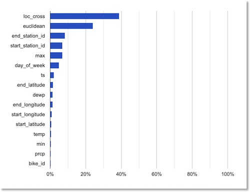
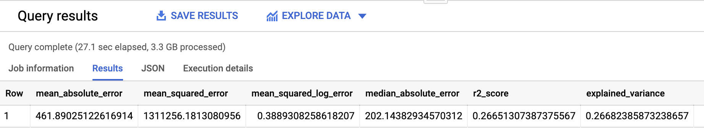
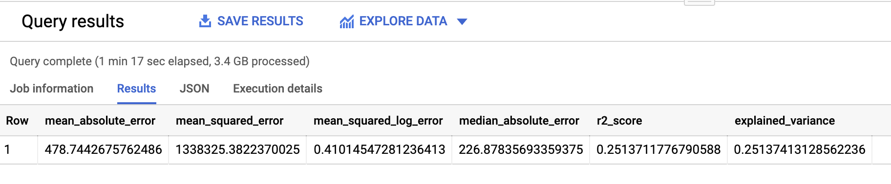
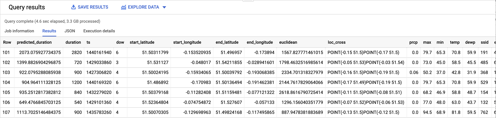

## Introduction

[BigQuery ML][1] (BQML) enables users to create and execute machine learning models in [BigQuery][2] by using SQL queries. \<The goal is to democratize machine learning by enabling SQL practitioners to build models using their existing tools and to increase development speed by eliminating the need for data movement.\>

[AutoML Tables][3] lets you automatically build, analyze, and deploy state-of-the-art machine learning models using your own structured data, and [explain prediction results][4]. It’s useful for a wide range of machine learning tasks, such as asset valuations, fraud detection, credit risk analysis, customer retention prediction, analyzing item layouts in stores, [solving comment section spam problems][5], [quickly categorizing audio content][6], [predicting rental demand][7], and more.
([This blog post][8] gives more detail on many of its capabilities).

Recently, BQML added [support for AutoML Tables models][9].  This makes it easy to train Tables models on your BigQuery data using standard SQL, directly from the BigQuery UI (or API), and to evaluate and use the models for prediction directly via SQL as well.

In this post, we’ll take a look at how to do this, and discuss a few tips as well.

## About the dataset and modeling task

The [Cloud Public Datasets Program][10] makes available public datasets that are useful for experimenting with machine learning. We’ll use data that is essentially a join of two public datasets stored in [BigQuery][11]: [London Bike rentals][12] and [NOAA weather data][13], with some additional processing to clean up outliers and derive additional GIS and day-of-week fields.  The table we’ll use is here: `aju-dev-demos.london_bikes_weather.bikes_weather`.

Using this dataset, we’ll build a _regression_ model to predict the `duration` of a bike rental based on information about the start and end rental stations, the day of the week, the weather on that day, and other data. (If we were running a bike rental company, we could use these predictions—and their explanations—to help us anticipate demand and even plan how to stock each location).

## Creating the training, eval, and test datasets

With BQML (in contrast to using the AutoML Tables API) we need to define our own dataset splits.  We’d like to create training, validation, and test data, but we don’t want the datasets to be sequential. There’s an easy way to do this in a repeatable manner by using the [Farm Hash algorithm][14], implemented as the `FARM_FINGERPRINT` BigQuery SQL function.  We’d like to create an 80/10/10 split.  

So, the query to generate training data will include a clause like this: 
```sql
WHERE ABS(MOD(FARM_FINGERPRINT(timestamp), 10)) < 8 
```
Similarly,  the query to generate the eval set will use this clause:
```sql
WHERE  ABS(MOD(FARM_FINGERPRINT(timestamp), 10)) = 8
```
… and the query for the test set will use `= 9`.  

## Tables schema configuration and BQML

If you’ve used AutoML Tables, you may have noticed that after a dataset is ingested, it’s possible to adjust the inferred field (column) schema information. For example, you might have some fields with numeric values that you’d like to treat as _categorical_ when you train your custom model.  This is the case for our dataset, where we’d like to treat the numeric rental station IDs as categorical.

With BQML, it’s not currently possible to explicitly specify the schema for the model inputs, but for numerics that we want to treat as categorical, we can provide a strong hint by casting them to strings; then Tables will decide whether to treat such values as ‘text’ or ‘categorical’.  So, in the SQL below, you’ll see that the `day_of_week`, `start_station_id`, and `end_station_id` columns are all cast to strings.

## Training the AutoML Tables model via BQML

To train the Tables model, we’ll pick the `AUTOML_REGRESSOR` model type (since we want to predict `duration`, a numeric value.  In the query, we’ll specify `duration` in the `input_label_cols` list (thus indicating the “label” column”, and set `budget_hours` to `1`, meaning that we’re budgeting one hour of training time. (The training process, which includes setup and teardown, etc., will typically take longer).

Here’s the resultant BigQuery query (to run it yourself, substitute your project id, dataset, and model name in the first line, then paste the query into the BigQuery UI query window in the [Cloud Console][15]):

```sql
CREATE OR REPLACE MODEL `YOUR-PROJECT-ID.YOUR-DATASET.YOUR-MODEL-NAME`
       OPTIONS(model_type='AUTOML_REGRESSOR',
               input_label_cols=['duration'],
               budget_hours=1.0)
AS SELECT
  duration, ts, cast(day_of_week as STRING) as dow, start_latitude, start_longitude, end_latitude, 
  end_longitude, euclidean, loc_cross, prcp, max, min, temp, dewp, 
  cast(start_station_id as STRING) as ssid, cast(end_station_id as STRING) as esid
FROM `aju-dev-demos.london_bikes_weather.bikes_weather`
WHERE
ABS(MOD(FARM_FINGERPRINT(cast(ts as STRING)), 10)) < 8 
```

Note the casts to `STRING` and the use of `FARM_FINGERPRINT` as discussed above.

(If you’ve taken a look at the `bikes_weather` table, you might notice that the `SELECT` clause does not include the `bike_id` column. A previously-run AutoML Tables analysis of the [global feature importance of the dataset fields][16] indicated that `bike_id` had negligible impact, so we won’t use it for this model).



## Evaluating your trained custom model
After the training has completed, you can evaluate your custom model.  The BigQuery SQL to do that looks like this (again, substitute your own project, dataset, and model name):

```sql
SELECT
  *
FROM
  ML.EVALUATE(MODEL `YOUR-PROJECT-ID.YOUR-DATASET.YOUR-MODEL-NAME`, (
SELECT
  duration, ts, cast(day_of_week as STRING) as dow, start_latitude, start_longitude, end_latitude, 
  end_longitude, euclidean, loc_cross, prcp, max, min, temp, dewp, 
  cast(start_station_id as STRING) as ssid, cast(end_station_id as STRING) as esid
FROM
  `aju-dev-demos.london_bikes_weather.bikes_weather`
WHERE
 ABS(MOD(FARM_FINGERPRINT(cast(ts as STRING)), 10)) = 8
 ))
```

Note that via the `FARM_FINGERPRINT` function, we’re using a different split for evaluation than we used for training.
The evaluation results should look something like the following:



### Did our schema hints help?

It’s interesting to check whether the schema hints (casting some of the numeric fields to strings) made a difference in model accuracy.
To try this yourself, create another differently-named model as shown in the training section above, but for the `SELECT` clause, don’t include the casts to `STRING`, e.g.:

```sql
...AS SELECT
  duration, ts, day_of_week, start_latitude, start_longitude, end_latitude, 
  end_longitude, euclidean, loc_cross, prcp, max, min, temp, dewp, start_station_id, end_station_id
```

Then, evaluate this second model (again substituting the details for your own project):

```sql
SELECT
  *
FROM
  ML.EVALUATE(MODEL `YOUR-PROJECT-ID.YOUR-DATASET.YOUR-MODEL-NAME2`, (
SELECT
  duration, ts, day_of_week, start_latitude, start_longitude, end_latitude, 
  end_longitude, euclidean, loc_cross, prcp, max, min, temp, dewp, start_station_id, end_station_id
FROM
  `aju-dev-demos.london_bikes_weather.bikes_weather`
WHERE
 ABS(MOD(FARM_FINGERPRINT(cast(ts as STRING)), 10)) = 8
 ))
```

When I evaluated this second model, which kept the station IDs and day of week as numerics, the results showed that this model was somewhat less accurate:




## Using your BQML AutoML Tables model for prediction

Once your model is trained, and you’ve ascertained it’s accurate enough, you can use it for prediction.
Here’s an example of how to do that.  Via the `FARM_FINGERPRINT` function, we’re drawing from our third “test” split, but because the resultant dataset is large, we’re just grabbing a few rows (200) for the query below:

```sql
SELECT * FROM ML.PREDICT(MODEL `YOUR-PROJECT-ID.YOUR-DATASET.YOUR-MODEL-NAME`, 
(SELECT   duration, ts, cast(day_of_week as STRING) as dow, start_latitude, start_longitude, end_latitude, 
  end_longitude, euclidean, loc_cross, prcp, max, min, temp, dewp, 
  cast(start_station_id as STRING) as ssid, cast(end_station_id as STRING) as esid
 FROM `aju-dev-demos.london_bikes_weather.bikes_weather` 
 WHERE ABS(MOD(FARM_FINGERPRINT(cast(ts as STRING)), 10)) = 9)) limit 200
```

The prediction results will look something like this:



Note that while the query above is “standalone”, you can of course access model prediction results as part of a larger BigQuery query too.

## Summary

In this post, we showed how to train an AutoML Tables model using BQML, evaluate the model, and then use it for prediction— all from BigQuery.
The [BQML documentation][17] has more detail on getting started, and resources for the other model types available through BQML.

[1]:	https://cloud.google.com/bigquery-ml/docs
[2]:	https://cloud.google.com/bigquery/docs
[3]:	https://cloud.google.com/automl-tables/docs/
[4]:	https://cloud.google.com/blog/products/ai-machine-learning/explaining-model-predictions-structured-data
[5]:	https://cloud.google.com/blog/products/ai-machine-learning/how-kaggle-solved-a-spam-problem-using-automl
[6]:	https://cloud.google.com/blog/products/ai-machine-learning/using-ai-to-scale-audio-content-categorization
[7]:	https://cloud.google.com/blog/products/ai-machine-learning/explaining-model-predictions-structured-data
[8]:	https://cloud.google.com/blog/products/ai-machine-learning/new-automl-features-and-end-to-end-workflows-on-ai-platform-pipelines
[9]:	https://cloud.google.com/bigquery-ml/docs/reference/standard-sql/bigqueryml-syntax-create-automl#limitations
[10]:	https://cloud.google.com/bigquery/public-data/
[11]:	https://cloud.google.com/bigquery/
[12]:	https://console.cloud.google.com/bigquery?p=bigquery-public-data&d=london_bicycles&page=dataset&_ga=2.10177653.-1341725502.1591817317
[13]:	https://console.cloud.google.com/bigquery?p=bigquery-public-data&d=noaa_gsod&page=dataset&_ga=2.208160978.-1341725502.1591817317
[14]:	https://github.com/google/farmhash
[15]:	https://console.cloud.google.com/bigquery
[16]:	https://cloud.google.com/automl-tables/docs/evaluate#evaluation_metrics_for_regression_models
[17]:	https://cloud.google.com/bigquery-ml/docs


